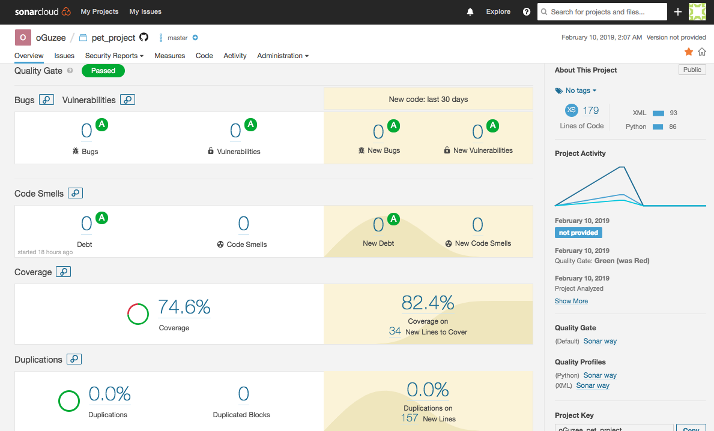
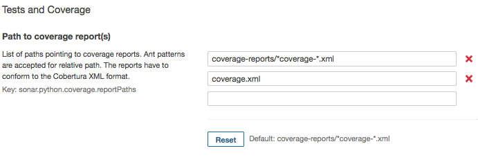
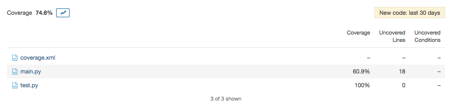

[](https://travis-ci.org/oGuzee/pet_project)

# Pet project: Formula 1 data classification

This project is an semester assignment. The aim is to develope code with criterea. Criterea like continuous delivery, clean code developement and functional programming. The following readme.md describes how the author accomplished those goals.

## KMeans classifier for Formula 1 data

The programm classifies Formula 1 lap data.

The data is open source and can be downloaded from ergast.com/mrd. I downloaded the data as an SQL dump, imported in a MySQL database and exported each table.

The only table used in the Project is *lapTimes*. It contains every driven lap, of every driver, at every race event since 1996. These are 440.000+ observations.

Default Data


We want it to look like this:


As you can see, there are 2 columns. *lap_milliseconds_diff* is the difference between lap time 't' and 't-1'. *label* is the computed cluster of the given instance. The aim is to cluster the data in such ways, that with domain knowledge and data visualization, one can see if a driver *push*ed, *preserve*d, is in a *pit-in-lap* or *pit-out-lap*, or if he had a on-track-*incident*. If the clustering is fits the review, add the labels to the DataFrame.

*Note: I choose to leave the first empty instace and didn't put the label feature at the beginning.*

### How does it work?

One script: main.py

main.py loads the data in the *f1db_csv* folder into a Pandas DataFrame and filters by chosen driver *(int(id))* and race event *(int(id))*. After, the lap time differences are computed and the DataFrame is stripped of most of it's colums so only *lap_milliseconds_diff* and *lap* remains.is stripped of most of it's colums so only *lap_milliseconds_diff* and *lap* remains.

This is the data structure to give to the KMeans() algorithm.
The cluster number k=5 was chosen to fit the wanted target labels. A figure of the date is saved in *figures* directory. The *labels* are added to DataFrame. The DataFrame is saved in the *saved_data* directory.

### Why I chose Formula 1 data

I want to write my masters thesis about Formula 1 data. By modelling a sequence classifier, that is feeded unseen Formula 1 lap data and predicts you if driver x will [*push*, *preserve*, *pit-stop*, *constant*] on lap 't+1,2,3'

## UML's

Packages

<center>Figure 3: Shows the used packages and respective methods</center>

Activity main


<center>Figure 4: The activity in main.py</center>


Activity main.k_means()


<center>Figure 4: The activity in main.k_means()</center>


## Metrics

### Sonarqube (Sonarcloud)



I passed the test! I also included some code coverage (*test.py*) and for some reason it does not include the tests. The solution: download the python module *coverage* and run a bash script on your test.py, then let *coverage* export you a Sonarqube-readable xml report file.

```
pip install coverage
coverage run /path/to/file
coverage xml -i
```
Returns you a XML file (*coverage.xml*). This file needs to be referenced to in Sonarcloud.

Go-to:
```
Administration > General Settings > Python
```
and scroll down until you see *Tests and Coverage* and add in the second line 'coverage.xml'.



Now re-run your evaluation and see your updated code coverage reports.

```
sonar-scanner \
  -Dsonar.projectKey=oGuzee_pet_project \
  -Dsonar.organization=oguzee-github \
  -Dsonar.sources=. \
  -Dsonar.host.url=https://sonarcloud.io \
  -Dsonar.login=[personalToken]
```




## PyLint

