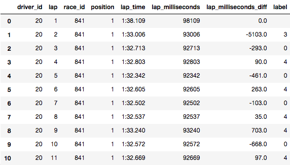

# Pet project: Formula 1 data classification

This project is an semester assignment. The aim is to develope code with criterea. Criterea like continuous delivery, clean code developement and functional programming. The following readme.md describes how the author accomplished those goals.

## KMeans classifier for Formula 1 data

The programm classifies Formula 1 lap data.

The data is open source and can be downloaded from ergast.com/mrd. I downloaded the data as an SQL dump, imported in a MySQL database and exported each table.

The only table used in the Project is *lapTimes*. It contains every driven lap, of every driver, at every race event since 1996. These are 440.000+ observations.

Default Data

We want it to look like this:

As you can see, there are 2 columns. *lap_milliseconds_diff* is the difference between lap time 't' and 't-1'. *label* is the computed cluster of the given instance. The aim is to cluster the data in such ways, that with domain knowledge and data visualization, one can see if a driver *push*ed, *preserve*d, is in a *pit-in-lap* or *pit-out-lap*, or if he had a on-track-*incident*. If the clustering is fits the review, add the labels to the DataFrame.

*Note: I choose to leave the first empty instace and didn't put the label feature at the beginning.*

### How?

The data is stripped of most of it's colums so only *lap_milliseconds_diff* and *lap* remains. Then turned into a numpy array and removed the first row. This is the data structure to give to the KMeans() algorithm.
The cluster number k=5 was chosen to fit the wanted target labels.

### Why I chose Formula 1 data

I want to write my masters thesis about Formula 1 data. By modelling a sequence classifier, that is feeded unseen Formula 1 lap data and predicts you if driver x will [*push*, *preserve*, *pit-stop*, *constant*] on lap 't+1,2,3'

## UML's

Packages

Activity main

Activity main.k_means()

