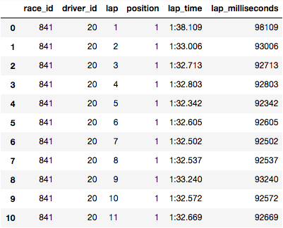
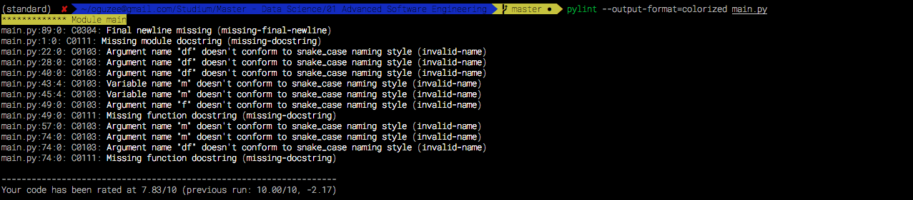

[](https://travis-ci.org/oGuzee/pet_project)

# Pet project: Formula 1 data classification

This project is an semester assignment. The aim is to develope code with criterea. Criterea like continuous delivery, clean code developement and functional programming. The following readme.md describes how the author accomplished those goals.

## KMeans classifier for Formula 1 data

The programm classifies Formula 1 lap data.

The data is open source and can be downloaded from ergast.com/mrd. I downloaded the data as an SQL dump, imported in a MySQL database and exported each table.

The only table used in the Project is *lapTimes*. It contains every driven lap, of every driver, at every race event since 1996. These are 440.000+ observations.




<center>Figure 1: Default Data</center>


<center>Figure 2: We want it to look like this!</center>


As you can see, there are 2 columns. *lap_milliseconds_diff* is the difference between lap time 't' and 't-1'. *label* is the computed cluster of the given instance. The aim is to cluster the data in such ways, that with domain knowledge and data visualization, one can see if a driver *push*ed, *preserve*d, is in a *pit-in-lap* or *pit-out-lap*, or if he had a on-track-*incident*. If the clustering is fits the review, add the labels to the DataFrame.

*Note: I choose to leave the first empty instace and didn't put the label feature at the beginning.*

### How does it work?

One script: main.py

main.py loads the data in the *f1db_csv* folder into a Pandas DataFrame and filters by chosen driver *(int(id))* and race event *(int(id))*. After, the lap time differences are computed and the DataFrame is stripped of most of it's colums so only *lap_milliseconds_diff* and *lap* remains.is stripped of most of it's colums so only *lap_milliseconds_diff* and *lap* remains.

This is the data structure to give to the KMeans() algorithm.
The cluster number k=5 was chosen to fit the wanted target labels. A figure of the date is saved in *figures* directory. The *labels* are added to DataFrame. The DataFrame is saved in the *saved_data* directory.

### Why I chose Formula 1 data

I want to write my masters thesis about Formula 1 data. By modelling a sequence classifier, that is feeded unseen Formula 1 lap data and predicts you if driver x will [*push*, *preserve*, *pit-stop*, *constant*] on lap 't+1,2,3'

## UML's

Packages


<center>Figure 3: Shows the used packages and respective methods</center>


Activity main


<center>Figure 4: The activity in main.py</center>


Activity main.k_means()


<center>Figure 5: The activity in main.k_means()</center>


## Metrics

### Sonarqube (Sonarcloud)


<center>Figure 6: Results of Sonarqube</center>


I passed the test! I also included some code coverage (*test.py*) and for some reason it does not include the tests. The solution: download the python module *coverage* and run a bash script on your test.py, then let *coverage* export you a Sonarqube-readable xml report file.

```
pip install coverage
coverage run /path/to/file
coverage xml -i
```
Returns you a XML file (*coverage.xml*). This file needs to be referenced to in Sonarcloud.

Go-to:
```
Administration > General Settings > Python
```
and scroll down until you see *Tests and Coverage* and add in the second line 'coverage.xml'.


<center>Figure 7: Settings</center>


Now re-run your evaluation and see your updated code coverage reports.

```
sonar-scanner \
  -Dsonar.projectKey=oGuzee_pet_project \
  -Dsonar.organization=oguzee-github \
  -Dsonar.sources=. \
  -Dsonar.host.url=https://sonarcloud.io \
  -Dsonar.login=[personalToken]
```


<center>Figure 8: My test coverage</center>


### PyLint



<center>Figure 9: more snake_case advertising</center>


PyLint isn't that fond of my naming style. Although, I do something conventional (every other Python Tutorial/Course uses those kinds of names), PyLint says it isn't conform with the PEP8 regulations - which makes sense. I would need some snake_case to name a 'df' > 'data_frame'. This would bloat the code unnecessary, it wouldn't be readable easily anymore. That's why I refrained to apply changes.

```
pylint --output-format=colorized filename.py
```

## Clean Code Developement


<center>Figure 10: Clean Code accoring to Sonarqube</center>


<center>Figure 11: Hooray!</center>


It seems like I have no code smells, nor any debt to pay!

### Precise Naming

I put value into precise naming. This is, because I am reusing my code regulary and like to remember what it did. I complied with Python *snake_case* regulation and not tried to make too long names.
Also, the usage of '\' was needed, so PyLint doesn't like to long lines.
```
def filter_by_race_and_driver_id(df, race, driver):
    return df[(df.race_id == race) & (df.driver_id == driver)]\
        .sort_values(['lap', 'position'])
```


### Not more than needed comments & annotations

Comments and annotations are helpful, when you can't figure out what code does. This is why I tend write docstrings very clear. Such that, after a long time, I still can comprehend what happened. Important is to give exmaples for parameters, and the expected return value.

```
def k_means(m, figurename):
    ''' <-- Start
    KMeans algorithm is applied. \
    Parameters: m = np.array; (shape==(X,2))\
                figurename = str; example =  "hamilton_australia_2011.png"\
    returns list; clustered labels of the instances
    ''' <-- End
    kmeans = KMeans(n_clusters=5, random_state=41).fit(m)
    ...
```

### Vertical Separation

Variables should be used immediately after they are created. All of my functions show, how to properly implement a variable and use it immediately.

```
def compute_time_diff(df):
    df = df.set_index(['driver_id', 'lap'])
    df_ = df.groupby(level=0)
    df_ = df_['lap_milliseconds'].diff()
    df = df.join(df_, on=['driver_id', 'lap'], lsuffix='', rsuffix='_diff')
    df = df.reset_index(level='lap')
    df = df.reset_index()
    df = df.fillna(0)
    return df
```

### Kill Useless Code

Useless code is code that doesn't contribute to the target. Print-statements to check the state of your code, or useless assignments should be deleted.

```
def to_numpy_matrix(df):
    '''Transform DataFrame to numpy ndarray [lap, lap_time_difference]'''
    df = df.drop(columns=['lap_milliseconds', 'position', 'lap_time', 'race_id', 'driver_id'])
    m = df.values
    print(type(m)) <-- DELETED
    m = np.delete(m, (0), axis=0)
    return m
```

## Continous Delivery


<center>Figure 12: History of Travis-CI builds</center>


<center>Figure 13: Four Tests ran successfully!</center>


Travis-CI was used thorught the whole of this project. It is very easy to install, it only requires you to allow access to your git-repository and wants you to make two files: *travis.yml* and *requirements.txt*

This is the code in the travis.yml:
```
language: python
python:
  - "3.6"
# command to install dependencies
install:
  - pip install -r requirements.txt
# command to run tests
script:
  - python test.py
```

And the requirements.txt which travis.yml refers to:
```
numpy==1.15.4
pandas==0.24.0
matplotlib==3.0.2
scikit_learn==0.20.2
```

You get the requirements for you Python script via *pipreqs* package:
```
pip install pipreqs
pipreqs filename.py
```

## DSL

DSL (Domain Specific Languages) are languages that are used to speak with machines or computers in a certain domain. SQL (Structured Query Language) is a well-known example for DSL to communicate with databases, especially relational databases.


<center>Figure 14: Four Tests ran successfully!</center>


*Note: This is just a mockup*

I decided to visualize the final data via HTML and the Python library *Plotly* and *Dash*. I used a Python script I used for Dr. Biessmann's class 'Urban Technologies'. I stripped the unnecessary code lines and changed the variables.

The code starts a webserver on ```127.0.0.1:8050``` and visualizes an interactive HTML table and a corresponding plot.

```
# Interactive Web App begins here
app.layout = html.Div([ <-- Plotly Dash HTML libary
    dcc.Markdown('''# DSL Example'''),
    html.Label('by Oguzhan Uyar'), <-- HTML Label
    html.Label('9.2.19'),

    dcc.Markdown(markdown_title),

    # Markdown html table
    dcc.Markdown(markdown_html_table),
    # Scatter Plot Dangerous

    # Interactive Data Table
    dt.DataTable(
    ...
```
The above code shows the corresponding HMTL element in the Browser.


<center>Figure 15: HTML elements</center>


This code will be adjusted in the future.

## Functional Programming

Final data structures as known in other programming languages as final variables (Java) or constants (C++) are not implemented in Python. So, assign a value to a variable only once and never change it again. Of course, Python provides an immutable data type called tuple. Tuples are sequences of Python objects, which are not editable.

```
mytuple = (3,2,4)   #define a tuple object
print(mytuple)      #output: (3, 2, 4)
mytuple[1] = 5      #TypeError: 'tuple' object does not support item assignment <-- important!
```

## Side-Effect Free Functions

Python is really not set up to enforce prevention of side-effects. You can try to deepcopy the data or use immutable types, but these still have corner cases that are tricky to catch, and it's just a ton more effort than it's worth.

Since I only use each functions once, all functions nearly side effect free. This means, every functions does once what it should on the DataFrame and returns it.

The data get mutated every time it is given to the function, but I chose this approach, since (again) I only use every function once.

An easy way to get around this would be to change the following:

```
def filter_by_race_and_driver_id(df, race, driver):
    return df[(df.race_id == race) & (df.driver_id == driver)]\
        .sort_values(['lap', 'position'])
```
```
def filter_by_race_and_driver_id(df, race, driver):
    new_df = df[(df.race_id == race) & (df.driver_id == drive]\
        .sort_values(['lap', 'position'])
    return new_df
```

## Higher Order Functions

Higher Order Functions accept other functions as arguments or return functions as values. Decorators, are high order functions and return functions as a value. The following decorator prints a timestamp and the function name when a decorated function is called:

```
def time_execution(f):
    def wrapped(*args, **kws):
        now = datetime.datetime.now()
        print('[' + str(now) + '] Call Function: ' + f.__name__ + '()')
        return f(*args, **kws)
    return wrapped

@time_execution <-- Here is the decorator!
def k_means(m, figurename):
```
returns:
```
[2019-02-10 17:19:54.467914] Call Function: k_means()
```

## Closures

A Closure is a function object that remembers values in enclosing scopes even if they are not present in memory. To avoid the usage of global variables, Closures can be used.

This is the exmaple in my code:
```
def outer_function():
    ''' Closure, prints the time the function is called'''
    now = datetime.datetime.now()
    def inner_function():
        print('Application started at: ', now)
    inner_function()
```

Further examples:
```
text = "global text"
def outer_func():
  text = "enclosing text"
  def inner_func():
    text = "inner text"
    print('inner_func:', text)	# inner_func: global text
  print('outer_func:', text)	# outer_func: enclosing text
  inner_func()
  print('outer_func:', text)	# outer_func: enclosing text

print('global:', text)	# global: global text
outer_func()
print('global:', text)	# global: global text
```
```
text = "global text"
def outer_func():
  text = "enclosing text"
  def inner_func():
  	global text	# binds the global text to the local text
  	text = "inner text"
  	print('inner_func:', text)	# inner_func: inner text
  print('outer_func:', text)	# outer_func: enclosing text
  inner_func()
  print('outer_func:', text)	# outer_func: enclosing text

print('global:', text)	# global: global text
outer_func()
print('global:', text)	# global: inner text
```